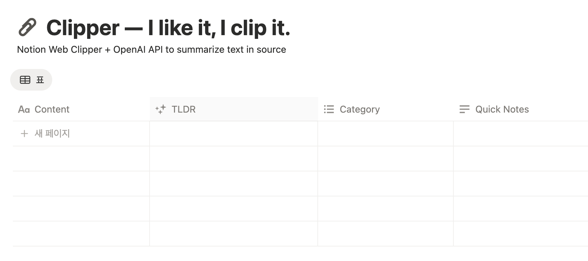

# Notion Web clippings AI Summarizer

**One-liner summary generator for Notion web clippings**

There is no point in saving posts, links, resources if you don't look back into it. Instead, export the link to it into your Notion database, then let this AI Summarizer summarize the content for you to read later.

## Setup

### 1. Notion Integration
1. Create integration: https://www.notion.so/my-integrations
2. Copy the integration token
3. Add connection to your database (⋮ menu → Add connections)
4. Get database ID from URL: `notion.so/workspace/THIS_IS_THE_ID?v=...`

### 2. OpenAI API
1. Get API key: https://platform.openai.com/api-keys
2. Add billing or use $5 free credits

### 3. GitHub Secrets
Add three secrets in **Settings → Secrets → Actions**:
- `NOTION_TOKEN` - Notion integration token
- `NOTION_DB_ID` - Database ID (32-char string)
- `OPENAI_API_KEY` - OpenAI API key

### 4. Database Setup
Add a **"TLDR"** property (type: Text) to your Notion database.

## Test
**Actions** tab → **Auto Summarize Notion Pages** → **Run workflow**

## Features
- Auto-detects Korean/English content
- Parallel processing (3x faster)
- One-liner summaries

## Estimated Cost
~$0.0006 per summary • $5 = ~7,500 summaries • Runs daily by default

## Schedule
Edit `.github/workflows/summarize.yml`:
```yaml
cron: '0 12 * * *'  # Daily at 12PM UTC
```
